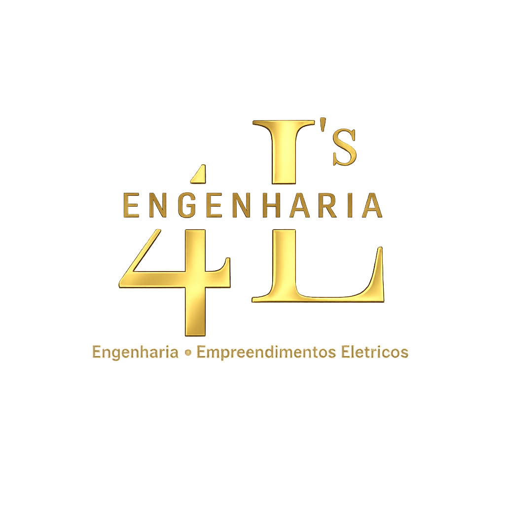

<!--
**4LsEngenharia/4lsengenharia** is a ✨ _special_ ✨ repository because its `README.md` (this file) appears on your GitHub profile.

Here are some ideas to get you started:

- 🔭 I’m currently working on ...
- 🌱 I’m currently learning ...
- 👯 I’m looking to collaborate on ...
- 🤔 I’m looking for help with ...
- 💬 Ask me about ...
- 📫 How to reach me: ...
- 😄 Pronouns: ...
- ⚡ Fun fact: ...
-->
<!DOCTYPE html>
<html lang="pt-BR">
<head>
  <meta charset="UTF-8" />
  <meta name="viewport" content="width=device-width, initial-scale=1.0" />
  <title>4LS Engenharia | Engenharia e Empreendimentos Elétricos</title>

  <meta name="description" content="4LS Engenharia - Engenharia e Empreendimentos Elétricos. Serviços técnicos e operacionais com qualidade, compromisso e parceria." />

  
</head>

<body>

  <!-- HEADER -->
  <header>
    

      

        

          
          

            <strong>4LS ENGENHARIA</strong>
            Engenharia e Empreendimentos Elétricos
          

        

        <nav>
          <button class="menu-btn" onclick="toggleMenu()">Menu</button>
          <ul id="menu">
            <li><a href="#inicio">Início</a></li>
            <li><a href="#servicos">Serviços</a></li>
            <li><a href="#sobre">Sobre</a></li>
            <li><a href="#parcerias">Parcerias</a></li>
            <li><a href="#contato">Contato</a></li>
          </ul>
        </nav>

        <a class="btn" href="#contato">Solicitar Orçamento</a>

      

    

  </header>

  <!-- HERO -->
  <section class="hero" id="inicio">
    

      

        

          <h1>
            Soluções em Engenharia com Qualidade e Compromisso
          </h1>

          

            A <strong>4LS Engenharia</strong> atua com excelência em serviços de engenharia e atividades operacionais,
            oferecendo suporte completo, agilidade e compromisso com prazos e qualidade.
          

          

            <a class="btn" target="_blank" href="https://wa.me/5577999158488">WhatsApp</a>
            <a class="btn-outline" href="tel:+5577999158488">Ligar</a>
            <a class="btn-outline" href="mailto:4lsengenharia@gmail.com">E-mail</a>
            <a class="btn-outline" target="_blank" href="https://www.instagram.com/4lsengenharia/">Instagram</a>
          

          

            Atendimento profissional • Responsabilidade • Segurança • Resultados
          

        

        

          <h3>Diferenciais da 4LS</h3>
          <ul>
            <li> Atendimento rápido e personalizado</li>
            <li> Compromisso com qualidade e segurança</li>
            <li> Profissionais qualificados</li>
            <li> Soluções para demandas industriais e operacionais</li>
            <li> Parcerias para locação de máquinas, caminhões e ferramentas</li>
          </ul>
        

      

    

  </section>

  <!-- SERVIÇOS -->
  <section id="servicos">
    

      <h2 class="title">Nossos Serviços</h2>
      

        Prestamos serviços completos para empresas e indústrias, oferecendo soluções eficientes, técnicas e operacionais.
      

      

        

          <h4>Engenharia e Serviços Técnicos</h4>
          
Atuação com planejamento, suporte e execução de atividades de engenharia em diversos setores.

        

        

          <h4>Empreendimentos Elétricos</h4>
          
Atividades e soluções voltadas para área elétrica, manutenção e suporte técnico especializado.

        

        

          <h4>Manutenção Industrial</h4>
          
Suporte em atividades industriais, manutenção preventiva e corretiva conforme necessidade do cliente.

        

        

          <h4>Serviços Operacionais</h4>
          
Atuação em campo e suporte operacional com foco em produtividade e segurança.

        

        

          <h4>Terceirização de Equipes</h4>
          
Fornecimento de mão de obra qualificada para demandas temporárias ou contínuas.

        

        

          <h4>Consultoria e Apoio Técnico</h4>
          
Consultoria e suporte para organização de serviços, execução e melhorias técnicas.

        

      

    

  </section>

  <!-- SOBRE -->
  <section id="sobre">
    

      <h2 class="title">Sobre a 4LS Engenharia</h2>
      

        Uma empresa comprometida em entregar soluções com excelência, segurança e confiança para seus clientes.
      

      

        

          <h3>Quem Somos</h3>
          

            A <strong>4LS Engenharia</strong> oferece soluções em engenharia e empreendimentos elétricos,
            atendendo demandas técnicas e operacionais com responsabilidade e qualidade.
          

          

            Trabalhamos com foco em resultados e na satisfação do cliente, mantendo compromisso com prazos e segurança.
          

          

            
Compromisso

            
Segurança

            
Qualidade

            
Parceria

          

        

        

          <h3>Missão, Visão e Valores</h3>
          
<strong style="color:var(--gold2);">Missão:</strong> entregar soluções eficientes e seguras em engenharia.

          
<strong style="color:var(--gold2);">Visão:</strong> ser referência em serviços técnicos e operacionais.

          
<strong style="color:var(--gold2);">Valores:</strong> ética, qualidade, confiança e profissionalismo.

        

      

    

  </section>

  <!-- PARCERIAS -->
  <section id="parcerias">
    

      <h2 class="title">Parcerias e Relacionamento</h2>
      

        Temos um excelente relacionamento com empresas parceiras de locação de máquinas, caminhões e ferramentas,
        garantindo suporte completo para atender nossos clientes com agilidade e estrutura.
      

      

        

          <h4>Locação de Máquinas</h4>
          
Parcerias com empresas qualificadas para locação de máquinas e equipamentos.

        

        

          <h4>Locação de Caminhões</h4>
          
Suporte logístico com caminhões para operações e transporte de materiais.

        

        

          <h4>Locação de Ferramentas</h4>
          
Ferramentas e equipamentos para execução de serviços técnicos e industriais.

        

      

    

  </section>

  <!-- CONTATO -->
  <section id="contato">
    

      <h2 class="title">Contato</h2>
      

        Solicite seu orçamento agora mesmo. Atendimento rápido e profissional.
      

      

        

          <h3>Informações</h3>
          
Entre em contato conosco pelos canais abaixo:

          

            <strong style="color:var(--gold2);">WhatsApp:</strong> (77) 99915-8488
            <strong style="color:var(--gold2);">E-mail:</strong> 4lsengenharia@gmail.com
            <strong style="color:var(--gold2);">Endereço:</strong> Rua Olegário Augusto Viana, Nº 458
            <strong style="color:var(--gold2);">Instagram:</strong> @4lsengenharia
            <strong style="color:var(--gold2);">CNPJ:</strong> 60.943.647/0001-89
          

           

          <a class="btn" target="_blank" href="https://wa.me/5577999158488">Falar no WhatsApp</a>
        

        

          <h3>Solicitar Orçamento</h3>

          <form onsubmit="enviarWhats(event)">
            <input type="text" id="nome" placeholder="Seu nome" required />
            <input type="text" id="empresa" placeholder="Empresa (opcional)" />
            <input type="text" id="telefone" placeholder="Seu WhatsApp" required />
            <textarea id="mensagem" placeholder="Descreva o serviço que precisa..." required></textarea>

            <button class="btn" type="submit">Enviar no WhatsApp</button>
          </form>
        

      

    

  </section>

  <!-- FOOTER -->
  <footer>
    

      

        © 2026 - 4LS Engenharia. Todos os direitos reservados. 
        CNPJ: 60.943.647/0001-89 | Rua Olegário Augusto Viana, Nº 458 
        Instagram: @4lsengenharia | E-mail: 4lsengenharia@gmail.com
      

    

  </footer>

  <!-- BOTÃO WHATSAPP -->
  <a class="whatsapp-float" target="_blank" href="https://wa.me/5577999158488">
    💬 WhatsApp
  </a>

  

</body>
</html>
